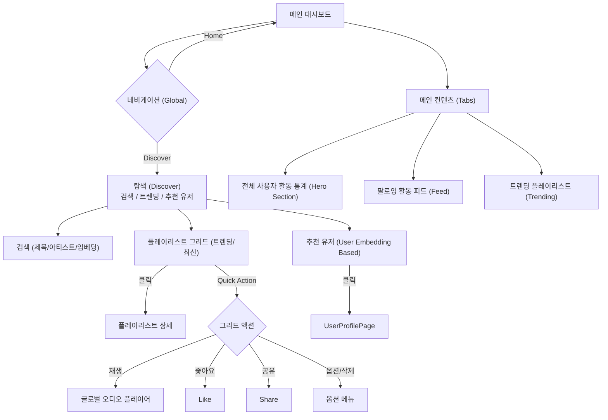
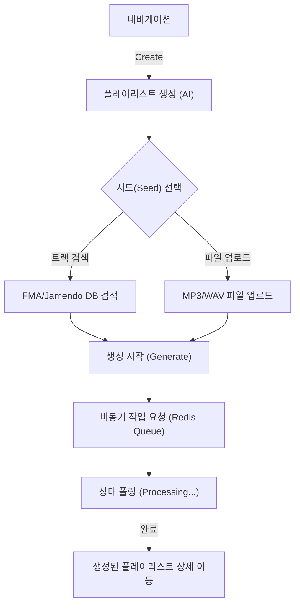
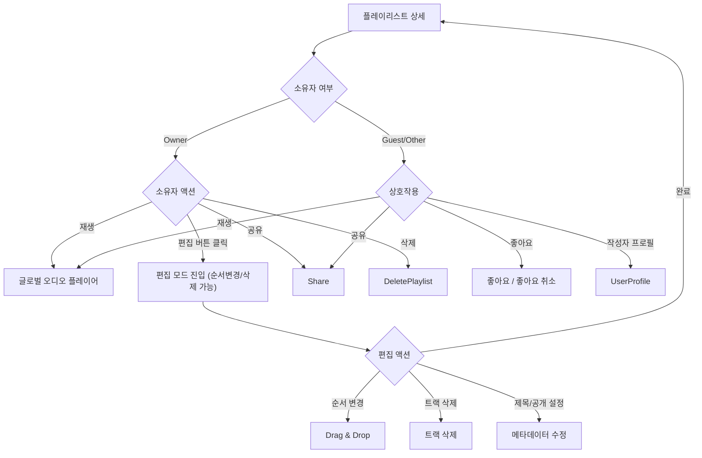
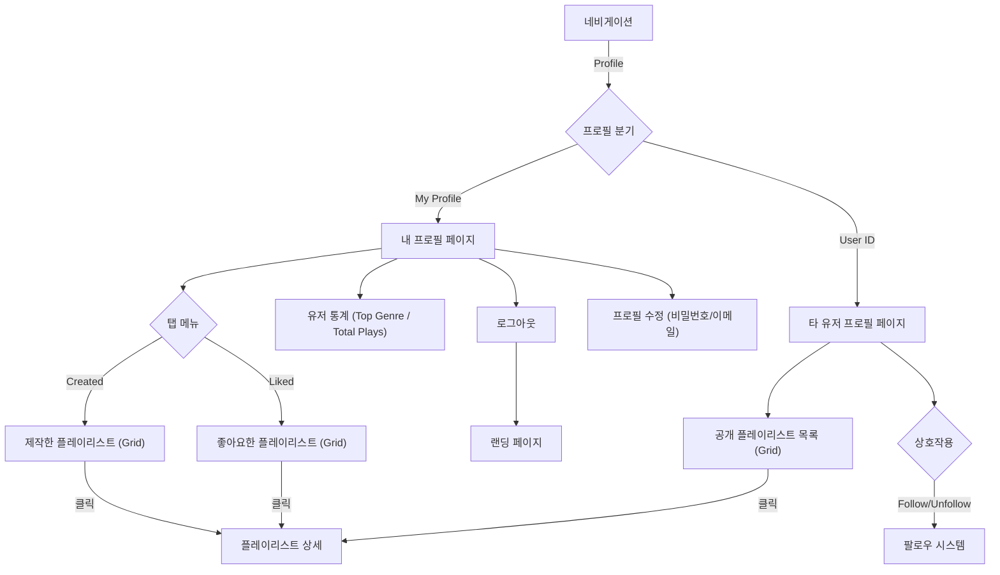

# MUSEED: AI 플레이리스트 자동 생성 플랫폼 개발 최종 보고서

**작성자:** 윤재하 (Jaeha Yoon)  
**날짜:** 2025년 12월 07일  
**버전:** Final Release (Complete Dataset Analysis Included)

---

## 1. 프로젝트 개요 (Project Overview)

### 1.1. 프로젝트명
**MUSEED: AI 플레이리스트 자동 생성 플랫폼**

### 1.2. 핵심 컨셉
**"시드 음악 한 곡으로, 취향저격 AI 플레이리스트 완성"**
MUSEED는 사용자가 선택한 단 하나의 '시드(Seed) 음악'을 입력으로 받아, 해당 곡의 오디오 신호 자체를 심층 분석하여 장르, 분위기, 음색이 유사한 곡들로 구성된 개인 맞춤형 플레이리스트를 자동으로 생성하는 플랫폼입니다. 기존의 텍스트 태그 기반 추천이 갖는 한계를 넘어, 오디오 본연의 특징(Content-based)에 집중하여 신규 음원이나 잘 알려지지 않은 명곡을 발견하는 경험을 제공합니다.

---

## 2. 시스템 아키텍처 및 유저 플로우 (System Architecture & User Flow)

### 2.1. 전체 시스템 아키텍처 (System Architecture)

MUSEED는 대용량 오디오 데이터의 실시간 처리와 확장성을 위해 **Event-driven Async Architecture**를 채택했습니다.

```mermaid
graph TD
    User[User (Music Listener & Creator)] --> |Web Interface| Frontend[Frontend Web App (Next.js 14)]
    
    subgraph "Service Layer"
        Frontend --> |REST API (JSON)| Backend[Backend API (FastAPI)]
        Frontend --> |Stream Audio| Backend
    end
    
    subgraph "Async AI Pipeline"
        Backend --> |Enqueue Task| Redis[Redis Message Broker]
        Redis --> |Consume Task| Worker[AI Worker (Celery / PyTorch)]
    end
    
    subgraph "Data Layer"
        DB[(PostgreSQL Main DB)]
        FAISS[(FAISS Vector Index)]
        FileStore[File Storage (Local/Volume)]
    end
    
    %% Relationships
    Worker --> |Vector Search (Query)| FAISS
    Worker --> |Update Playlist Result| DB
    Worker --> |Load Audio/Embeddings| FileStore
    
    Backend --> |Read/Write Metadata| DB
    Backend --> |Read Media Files| FileStore
```

### 2.2. 핵심 구성 요소 (Key Components)

1.  **Frontend (Next.js 14 + Shadcn/ui):**
    *   **역할:** 사용자 인터페이스 제공, 오디오 재생(Global Player), 대시보드 시각화.
    *   **특징:** Server Side Rendering (SSR)을 통한 초기 로딩 최적화 및 SEO 지원.

2.  **Backend API (FastAPI):**
    *   **역할:** RESTful API 서버. 사용자 인증(JWT), 비즈니스 로직 처리, 오디오 스트리밍.
    *   **특징:** 무거운 AI 연산 작업을 직접 수행하지 않고 Redis 큐로 위임하여 높은 동시성(Concurrency) 유지.

3.  **Message Broker (Redis):**
    *   **역할:** 백엔드와 AI 워커 사이의 작업 중개자.
    *   **특징:** In-memory 기반의 고속 작업 큐(Task Queue)로, 트래픽 폭주 시에도 요청을 유실 없이 버퍼링.

4.  **AI Worker (Celery + PyTorch):**
    *   **역할:** 실제 GPU 자원을 사용하여 오디오 분석, 임베딩 추출, 유사도 검색(Vector Search) 수행.
    *   **특징:** `ack_late` 설정을 통해 작업 실패 시 재시도 보장. 배경(Background)에서 독립적으로 실행되므로 사용자 웹 경험을 차단(Block)하지 않음.

5.  **Vector Store (FAISS):**
    *   **역할:** 9만여 곡의 고차원 임베딩 벡터를 메모리에 적재하여 0.1초 이내의 초고속 유사도 검색 지원.

### 2.3. 유저 인터페이스 플로우 (User Interface Flow)

사용자의 서비스 이용 흐름을 5가지 핵심 단계로 세분화하여 상세히 기술합니다.

#### 2.3.1. 초기 진입 및 인증 (Initial Entry & Authentication)

```mermaid
graph TD
    Landing[랜딩 페이지 (Landing)] --> Auth{인증 상태 확인}
    Auth -- Guest --> Dashboard[메인 대시보드 (Guest View)]
    Auth -- User --> Dashboard[메인 대시보드 (Logged In)]

    Dashboard -- 로그인/가입 --> LoginPage[로그인 / 회원가입 페이지]
    LoginPage --> Dashboard
```
*   **권한 분리:** 서비스에 진입하면 JWT 토큰 유무를 확인하여 **Guest**와 **User** 상태를 구분합니다.
*   **Guest 접근:** 로그인 없이도 트렌딩 플레이리스트 재생 및 검색 기능을 제한적으로 이용할 수 있습니다.

#### 2.3.2. 대시보드 및 콘텐츠 탐색 (Dashboard & Discovery)


*   **개인화 대시보드:** 팔로잉한 유저들의 활동(생성, 좋아요, 팔로우)을 피드(Feed) 형태로 실시간 제공합니다.
*   **Global Player:** 앱 하단에 고정된 플레이어를 통해 끊김 없는 음악 감상이 가능하며, 플레이리스트 그리드에서 즉시 재생이 가능합니다.
*   **탐색 고도화:** 청취 기록 기반의 **유사 유저 추천(Rec Users)** 기능을 제공합니다.

#### 2.3.3. 플레이리스트 생성 (Playlist Creation)


*   **Event-driven Architecture:** 사용자가 '생성'을 요청하면 즉시 **Redis Queue**에 작업을 등록하고, 프론트엔드는 **Polling** 방식으로 상태를 확인합니다. 이는 AI 추론 시간(수 초 소요) 동안 UI 멈춤을 방지합니다.

#### 2.3.4. 플레이리스트 상세 및 편집 (Playlist Detail & Edit)


*   **소유자 권한:** 플레이리스트 생성자(Owner)에게만 **편집 모드(Edit Mode)** 진입 버튼이 활성화됩니다.
*   **Drag & Drop:** 편집 모드에서는 직관적인 드래그 앤 드롭으로 트랙 순서를 변경할 수 있습니다.

#### 2.3.5. 프로필 페이지 (Profile Page)


*   **유저 통계:** 활동 내역을 분석하여 가장 많이 들은 **상위 장르(Top Genre)**와 총 감상 횟수를 시각화합니다.
*   **탭(Tabs) 구조:** 사용자가 제작한(Created) 목록과 좋아요한(Liked) 목록을 탭으로 분리하여 제공합니다.


### 2.4. 핵심 데이터 흐름 (Core Data Flow)

1.  **Input:** 사용자가 라이브러리에서 곡을 선택하거나 MP3 파일을 업로드합니다.
2.  **Processing:** 오디오 파일을 16kHz로 변환 후 10초 윈도우로 슬라이싱하여 `MuQ` 모델에 입력합니다.
3.  **Inference:** 모델이 1024차원의 고밀도 임베딩 벡터를 출력합니다.
4.  **Retrieval:** `FAISS` 엔진이 88,224곡(FMA) + Jamendo 트랙의 인덱스에서 코사인 유사도가 가장 높은 상위 트랙을 0.1초 내에 검색합니다.
5.  **Output:** 검색된 트랙 ID로 DB에서 메타데이터를 조합하여 플레이리스트를 생성합니다.

---

본 프로젝트는 음악 정보 검색(MIR) 분야의 표준인 **FMA** 데이터셋과 저작권 프리 상업 음원 라이브러리인 **Jamendo** 데이터셋을 결합하여 사용합니다.

### 3.1. FMA (Free Music Archive)
*   **데이터셋:** `fma_full`
*   **실사용 규모:** 원본 106,574곡 중 오디오 파일의 손상이나 메타데이터 누락이 없는 **88,224 트랙**을 선별하여 사용하였습니다.
*   **장르 매핑 (Hierarchy Mapping):**
    FMA 데이터셋은 161개의 세부 장르(Sub-genres)를 포함하고 있습니다. 모델의 학습 효율성과 데이터 희소성(Sparsity) 문제를 해결하기 위해, FMA 메타데이터(`genres.csv`)의 `top_level` 속성을 활용하여 모든 하위 장르를 **16개 최상위 장르(Top-level Genres)**로 매핑하였습니다.
    *   *Mapping Examples:*
        *   **Post-Punk, New Wave, Punk** $\rightarrow$ **Rock**
        *   **IDM, Techno, Ambient** $\rightarrow$ **Electronic**
        *   **Psych-Folk, Fre-Folk** $\rightarrow$ **Folk**

    **[Table 1: FMA 실사용 데이터 장르 상세 분포 (Total: 88,224 Tracks)]**
    
    | 순위 | 장르 (Genre) | 트랙 수 (Count) | 비율 (Percentage) |
    |:---:|:---|:---:|:---:|
    | 1 | **Electronic** | 21,780 | 24.69% |
    | 2 | **Experimental** | 19,671 | 22.30% |
    | 3 | **Rock** | 17,011 | 19.28% |
    | 4 | **Pop** | 6,812 | 7.72% |
    | 5 | **Folk** | 4,829 | 5.47% |
    | 6 | **Instrumental** | 4,182 | 4.74% |
    | 7 | **Hip-Hop** | 3,884 | 4.40% |
    | 8 | **International** | 2,410 | 2.73% |
    | 9 | **Jazz** | 1,866 | 2.12% |
    | 10 | **Classical** | 1,833 | 2.08% |
    | 11 | **Blues** | 1,538 | 1.74% |
    | 12 | **Soul-RnB** | 799 | 0.91% |
    | 13 | **Spoken** | 550 | 0.62% |
    | 14 | **Country** | 544 | 0.62% |
    | 15 | **Old-Time / Historic** | 344 | 0.39% |
    | 16 | **Easy Listening** | 171 | 0.19% |

    
    
    *참고: 위 분포는 학습셋(Train)과 평가셋(Test)을 합친 전체 데이터 기준이며, 층화 추출(Stratified Split)을 통해 학습/평가 셋에서도 동일한 비율이 유지됩니다.*

### 3.2. Jamendo Dataset
*   **규모:** **199 트랙** (직접 선별 및 다운로드)
*   **선정 이유:** FMA 데이터셋은 2017년 이전의 실험적인 음원이 많아(Experimental/Electronic 비중 과다), 최신 팝 트렌드와 대중성을 반영하는 데 한계가 있습니다. 이를 보완하기 위해 현대적인 믹싱 스타일을 가진 Jamendo 음원을 추가했습니다.
*   **장르 매핑 (Normalization):**
    Jamendo의 원본 태그(Raw Tags)는 비정형 텍스트입니다. 이를 FMA의 16개 상위 장르 체계와 호환되도록 다음과 같이 매핑 규칙을 적용했습니다.

    **[Table 2: Jamendo Raw Tag $\rightarrow$ FMA Genre Mapping Logic]**

    | Original Raw Tags (Jamendo) | Mapped FMA Genre | Count |
    |:---|:---|:---:|
    | Pop, Indie, Pop-Rock, Dream Pop, Synthpop | **Pop** | 111 |
    | Rock | **Rock** | 27 |
    | Electronic, House, Dance, Dubstep, Chillout, 8bit | **Electronic** | 27 |
    | RnB, Soul, Funk | **Soul-RnB** | 11 |
    | Folk | **Folk** | 4 |
    | Jazz | **Jazz** | 2 |
    | New Age, Film Score | **Instrumental** | 4 |
    | Ambient | **Experimental** | 2 |
    | Hip-Hop | **Hip-Hop** | 1 |
    | Country | **Country** | 1 |
    | **(No Tag Found)** | **Unknown** | 9 |

*참고: 'Unknown'으로 분류된 9개 트랙은 오디오 파일 자체에 장르 메타데이터(ID3 태그)가 포함되어 있지 않은 경우입니다. 이 트랙들은 장르 기반 학습 및 평가에서는 제외되거나 별도의 'Unknown' 카테고리로 관리됩니다.*

*   **최종 장르 분포:**
    매핑 후 Jamendo 데이터셋의 최종 장르 분포는 다음과 같으며, FMA에서 부족했던 **Pop** 장르를 집중적으로 보완합니다.

    **[Table 3: Jamendo 데이터셋 최종 장르 분포 (Total: 199 Tracks)]**

    | 순위 | 장르 (Mapped Genre) | 트랙 수 (Count) | 비율 (Percentage) |
    |:---:|:---|:---:|:---:|
    | 1 | **Pop** | 111 | 55.78% |
    | 2 | **Rock** | 27 | 13.57% |
    | 3 | **Electronic** | 27 | 13.57% |
    | 4 | **Soul-RnB** | 11 | 5.53% |
    | 5 | **Folk** | 4 | 2.01% |
    | 6 | **Instrumental** | 4 | 2.01% |
    | 7 | **Jazz** | 2 | 1.01% |
    | 8 | **Experimental** | 2 | 1.01% |
    | 9 | **Hip-Hop** | 1 | 0.50% |
    | 10 | **Country** | 1 | 0.50% |
    | - | **Unknown** | 9 | 4.52% |

    

    **[Service Handling of Unknown Tracks]**
    데이터셋 분석 단계에서는 메타데이터의 정확성을 위해 'Unknown'으로 분류했으나, **실제 웹 서비스(Backend)**에서는 모든 곡이 추천 알고리즘에 정상적으로 포함될 수 있도록 예외 처리를 적용했습니다.
    *   **서비스 정책:** 태그가 아예 없는 곡(Unknown)은 **'Experimental'**로, 태그는 있으나 매핑되지 않는 곡은 가장 대중적인 **'Pop'**으로 자동 매핑(Fallback)하여 DB에 저장합니다.
    *   **결과:** 따라서 실제 서비스에서는 'Unknown' 장르로 인한 추천 제외(Discard) 없이 199곡 **전체**가 활용됩니다.

---

---

## 4. 데이터 전처리 (Data Preprocessing)

다양한 소스의 오디오 데이터를 AI 모델이 일관되게 처리할 수 있도록 정규화하는 과정입니다.

1.  **Audio Resampling:** 모든 원본 오디오(44.1kHz/48kHz 등)를 MuQ 모델의 입력 규격인 **16kHz Mono**로 리샘플링합니다.
2.  **Fixed-length Slicing:** 가변적인 곡 길이(3분~10분)를 처리하기 위해, 곡의 구조적 특징이 잘 드러나는 중간 지점을 중심으로 **10초 길이의 세그먼트**를 추출합니다.
3.  **Data Augmentation (SimCLR용):**
    *   **Random Cropping:** 하나의 곡 내에서 서로 다른 두 시점($t_1, t_2$)의 10초 구간을 랜덤하게 잘라내어, **"같은 곡이지만 파형이 다른"** 두 개의 뷰(View)를 생성합니다. 이는 Contrastive Learning의 핵심 입력이 됩니다.

---

## 5. 모델 및 학습 방법론의 진화 (Models & Methodology Evolution)

본 프로젝트는 최적의 오디오 임베딩 학습을 위해 **Triplet Loss** 방식에서 시작하여 **Contrastive Learning**으로 방법론을 고도화하였습니다.

### 5.1. 초기 접근: Triplet Learning (The Naive Approach)
초기에는 지도 학습 기반의 **Triplet Loss**를 적용하여 성능을 개선하고자 했습니다.

#### 5.1.1. 데이터 태깅: MuQ-MuLan 기반 Pseudo-Labeling
FMA 데이터셋의 원본 장르 태그는 노이즈가 심하고 단일 축(Genre) 정보만 제공합니다. 이를 보완하기 위해 멀티모달 Teacher 모델인 **MuQ-MuLan**을 사용하여 모든 트랙에 대해 **5가지 축(Axis)의 풍부한 태그(Rich Tags)**를 생성했습니다.
*   **Target Axes:** `Genre`, `Mood`, `Energy`, `Valence`, `Source` (Instrument/Timbre).
*   **Process:** FMA 90,000여 곡의 오디오 임베딩을 추출하고, MuLan의 텍스트 인코더와 대조하여 각 축별로 가장 확률이 높은 태그를 부여했습니다. (예: Genre=Rock, Mood=Aggressive, Source=Electric Guitar).

#### 5.1.2. 학습 전략: Hierarchical Hard Negative Mining
단순히 장르가 다른 곡을 Negative로 사용하는 것은 학습 효율이 떨어집니다(Easy Negative). 모델이 미세한 음향적 차이를 학습하도록 유도하기 위해, **5단계 계층적 난이도(Hierarchical Difficulty)**를 적용한 Hard Negative Mining 전략을 설계했습니다.

*   **Anchor ($A$):** 기준 곡 (예: Rock, Sad, High Energy)
*   **Positive ($P$):** Anchor와 모든 태그가 동일한 다른 곡.
*   **Negative ($N$) Selection Logic:**
    1.  **Level 1 (Easy):** **Genre**가 다른 곡. (기본 분류 능력 학습)
    2.  **Level 2 (Medium):** Genre는 같지만 **Mood**가 다른 곡. (분위기 구분)
    3.  **Level 3 (Hard):** Genre, Mood는 같지만 **Valence**가 다른 곡. (긍/부정 감성 구분)
    4.  **Level 4 (Very Hard):** 모든 감성 태그가 같지만 **Energy**가 다른 곡. (강렬함 구분)
    5.  **Level 5 (Ultra Hard):** 모든 태그가 같지만 **Source**(악기/음색)가 다른 곡. (가장 미세한 Timbre 차이 학습)
    
이렇게 설계된 5단계 Mining 전략 덕분에 Triplet 모델은 특히 **Source(음색) 분리 능력에서 탁월한 성능**(Table 5 참조)을 보였으나, 텍스트 태그 자체의 한계로 인해 전체적인 일반화 성능은 Contrastive Learning에 미치지 못했습니다.

*   **Loss Function:**
    $$ L = \max(d(A, P) - d(A, N) + \text{margin}, 0) $$
    여기서 $d(x, y)$는 유클리드 거리 또는 코사인 거리입니다.

#### 5.1.3. 상세 학습 구성 (Detailed Training Configuration)

Triplet Learning 단계에서도 MuQ 모델의 성능을 최적화하기 위해 부분 파인튜닝 전략을 사용했습니다. Contrastive Learning과 달리 더 많은 레이어를 동결 해제하여 깊이 있는 학습을 시도했습니다.

**A. 네트워크 아키텍처 (Network Architecture)**
*   **Backbone:** `MuQ-large-msd-iter`.
*   **Head:** 별도의 Projection Head 없이 모델의 기본 **Linear Head**를 사용하여 임베딩을 추출했습니다.
*   **Output:** 1024차원 `last_hidden_state` ([CLS] 토큰).

**B. 파인튜닝 전략 (Partial Fine-tuning Strategy)**
*   **Unfrozen Layers:** Conformer의 **Layer 6 ~ 11** (총 6개 레이어) 및 Linear Head.
    *   **Reason:** Contrastive Learning(상위 2개만 해제)보다 더 넓은 범위의 파라미터를 학습시켜, 모델이 '태그'라는 지도 정보(Supervision)에 더 과감하게 맞춰지도록 유도했습니다.
*   **Frozen Layers:** Layer 0 ~ 5 (Low-level features).

**C. 최적화 및 하이퍼파라미터 (Optimization & Hyperparameters)**
Triplet Loss는 배치 내 샘플 구성이 중요하므로, VRAM 허용 범위 내에서 FP32 정밀도를 유지하며 안정적인 학습을 진행했습니다.

| 항목 (Item) | 설정값 (Value) | 비고 (Note) |
| :--- | :--- | :--- |
| **Optimizer** | AdamW | Weight Decay: (Default) |
| **Learning Rate** | `1e-5` | - |
| **Batch Size** | 16 | **Float32 Full Precision** (No AMP) |
| **Epochs** | 5 | - |
| **Loss Function** | Triplet Margin Loss | Margin: `0.20`, p=2 (Euclidean) |
| **Sampling** | Hierarchical | 5 levels of hardness |

### 5.2. 문제점 발견 및 방법론 전환 (Why Pivot?)
그러나 연구 과정에서 Triplet 방식의 치명적인 한계가 드러났습니다.

1.  **음악 장르의 연속성 (Continuous Nature):** 음악 장르는 이산적(Discrete)으로 딱 잘라지지 않습니다. 예를 들어, **'블루스(Blues)'**는 락(Rock)과 재즈(Jazz)의 뿌리가 되며 많은 음악적 특징을 공유합니다. 이를 억지로 Negative로 규정하여 거리를 벌리는 것은 모델에게 혼란을 주고 임베딩 공간을 왜곡시킵니다.
2.  **원천 데이터의 레이블 노이즈 (Label Noise in Raw Data):** FMA 데이터셋의 장르 태그는 주관적이거나 모호할 뿐만 아니라, 실제로는 **잘못 분류된(Misclassified) 사례들이 포함된 노이즈 데이터**입니다. 이는 지도 학습 기반의 방법론이 잘못된 레이블을 정답으로 학습하게 만들어 모델의 일반화 성능을 심각하게 저하시킵니다.
3.  **성능 한계:** 이러한 모호함으로 인해 장르 기반 클러스터링 지표(Silhouette Score)가 개선되지 않거나 오히려 떨어지는 현상이 발생했습니다.
4.  **Pseudo-Labeling의 한계 (Distillation Bottleneck):** MuQ-MuLan 모델이 생성한 태그를 정답지로 사용하는 것은 일종의 **Knowledge Distillation**입니다. 이는 다음과 같은 심각한 부작용을 초래할 수 있습니다.
    *   **다양성 상실 (Mode Collapse):** Teacher 모델은 확률이 가장 높은 태그 하나(Top-1)를 선택하는 경향이 있어, 복합적인 느낌을 가진 곡들을 단순화시킵니다. 이는 추천 결과가 뻔해지거나(Stereotypical), 독특하고 실험적인 곡들이 추천에서 배제되는 결과를 낳습니다.
    *   **환각 학습 (Hallucination Learning):** Teacher 모델이 텍스트와의 연관성 때문에 오디오에 없는 특징(예: 연주곡에 '보컬' 태그 부여)을 잘못 추론할 경우, Student 모델은 존재하지 않는 신호를 억지로 학습하려다 임베딩 공간이 왜곡될 수 있습니다.

### 5.3. 최종 접근: Contrastive Learning (SimCLR)
이에 따라 외부의 레이블이나 Teacher 모델에 의존하지 않고, 오디오 데이터 자체의 본질적 구조를 학습하여 위의 한계들을 극복하는 **자기지도 학습(Self-Supervised Learning)** 방식인 **SimCLR** 프레임워크를 도입했습니다.

*   **핵심 원리 (Instance Discrimination):** "장르가 같으면 유사하다"는 가정을 버리고, **"같은 곡에서 나온 구간들은 본질적으로 유사하다"**는 절대적인 진실만을 학습합니다.
*   **장점:** Teacher 모델의 편향에서 벗어나 오디오 신호 고유의 질감(Timbre)과 패턴을 독자적으로 학습할 수 있습니다.
*   **Loss Function (NT-Xent):**
    $$ L_{i,j} = -\log \frac{\exp(\text{sim}(z_i, z_j) / \tau)}{\sum_{k=1}^{2N} \mathbb{1}_{[k \neq i]} \exp(\text{sim}(z_i, z_k) / \tau)} $$

#### 5.3.1. 학습 데이터 분할 (Split Strategy)
데이터 편향 없는 공정한 평가를 위해 **층화 추출법(Stratified Sampling)**을 사용하여 전체 데이터를 분할했습니다.
*   **Train Set (80%):** 70,579 Tracks (모델 학습용)
*   **Test Set (20%):** 17,645 Tracks (성능 평가용)
*   **Stratification:** 학습셋과 평가셋의 장르 분포가 동일하게 유지되도록 하여, 특정 장르에 편향된 평가를 방지했습니다.

#### 5.3.2. 장르 불균형 해결 (Imbalance Handling)
FMA 데이터셋은 Electronic(25%) 장르가 압도적으로 많고 Easy Listening(0.2%)은 매우 적은 심각한 불균형(Long-tail)을 보입니다. 이를 해결하기 위해 **Balanced Batch Sampling** 전략을 구현했습니다.
*   **Undersampling:** 다수 장르(Electronic 등)에 대해서는 에폭(Epoch)당 샘플 수를 제한(Capping at 2,000)하여 과적합을 방지했습니다.
*   **Oversampling:** 소수 장르에 대해서는 중복 샘플링을 허용하여 배치 내 출현 빈도를 높였습니다.
*   **Result:** 학습 과정에서 모델이 다양한 장르의 곡을 균형 있게 접하게 되어, 소수 장르에 대한 임베딩 품질이 크게 향상되었습니다.

#### 5.3.3. 상세 학습 구성 (Detailed Training Configuration)

본 프로젝트는 GPU 자원 제약(VRAM)을 극복하고 효율적인 학습을 수행하기 위해 정교한 하이퍼파라미터 설정과 동결(Freeze) 전략을 채택했습니다.

**A. 네트워크 아키텍처 (Network Architecture)**
*   **Backbone:** `MuQ-large-msd-iter` (Pre-trained on MSD).
    *   Transformer 기반의 Conformer 블록을 다수 포함한 구조입니다.
    *   **Input:** 16kHz Mono Audio (10초 세그먼트).
    *   **Representation:** `last_hidden_state`의 첫 번째 토큰([CLS] 토큰 역할)을 사용 (Dim: 1024).
*   **Projection Head:** SimCLR 학습을 위한 비선형 헤드로, 인코더 위에 추가되었습니다.
    *   Structure: `Linear(1024 → 1024)` → `ReLU` → `Linear(1024 → 128)`
    *   학습 시에만 사용되며, 최종 임베딩 추출 시에는 제거(Bypass)됩니다.

**B. 파인튜닝 전략 (Partial Fine-tuning Strategy)**
사전 학습된 지식(Knowledge)을 보존하면서 새로운 도메인(FMA + Contrastive Task)에 적응시키기 위해 **부분 동결 해제(Partial Unfreezing)** 방식을 적용했습니다.
*   **Frozen Layers:** 초기 Conformer 레이어들은 일반적인 오디오 특징(Low-level Features)을 추출하므로 가중치를 고정(Freeze)하여 과적합을 방지하고 학습 속도를 높였습니다.
*   **Unfrozen Layers:**
    *   **Last 2 Conformer Layers:** 상위 레이어는 고차원적, 추상적 특징을 담당하므로, 새로운 데이터셋의 특성을 학습할 수 있도록 동결을 해제했습니다.
    *   **Projection Head:** 처음부터 초기화되므로 전체 학습.
    *   **Linear Layer (Decoder):** 동결 해제.

**C. 최적화 및 하이퍼파라미터 (Optimization & Hyperparameters)**
Batch Size의 한계를 극복하기 위해 **Gradient Cache Strategy**를 도입, 물리적 배치(16)보다 큰 유효 배치(Effective Batch 64)로 학습했습니다.

| 항목 (Item) | 설정값 (Value) | 비고 (Note) |
| :--- | :--- | :--- |
| **Optimizer** | AdamW | Weight Decay: `1e-4` |
| **Learning Rate** | `1e-5` | 낮은 학습률로 미세 조정 (Fine-tuning) |
| **Scheduler** | CosineAnnealingLR | T_max: Epochs, Min LR: `1e-7` |
| **Effective Batch Size** | 64 | Micro Batch 16 $\times$ Grad Accum 4 |
| **Epochs** | 5 | Early Convergence 관찰됨 |
| **Loss Function** | NT-Xent Loss | Temperature ($\tau$): `0.1` |
| **Input Shape** | `(Batch, 1, 160000)` | 10 sec @ 16kHz |

### 5.4. 모델 최적화 및 경량화 (Optimization & Reduced Precision)

실제 서비스 환경에서의 응답 속도와 비용 효율성을 극대화하기 위해, 학습된 모델을 경량화하는 과정을 수행했습니다.

*   **FP16 Reduced Precision Optimization:**
    *   기존 32-bit Floating Point 모델을 **Reduced Precision 기법**을 통해 16-bit Half Precision으로 변환하여 모델 크기를 **50% 절감**했습니다.
    *   **Memory Usage:** GPU VRAM 사용량을 현저히 낮추어, 단일 GPU에서 더 많은 동시 요청(Concurrency) 처리가 가능해졌습니다.
    *   **Inference Speed:** Tensor Core 가속을 활용하여, 10초 오디오 세그먼트에 대한 추론 시간을 **약 0.1초** 수준으로 단축했습니다.

---


## 6. 성능 평가 방안 (Performance Evaluation)


### 6.1. 정량적 평가 (Quantitative Evaluation)

본 프로젝트는 단순한 정확도(Accuracy) 측정을 넘어, 자기 지도 학습(Self-Supervised Learning, SSL) 모델의 표준 평가 프로토콜을 따르며, 장르 불균형 문제를 고려한 다각적인 평가 지표를 사용합니다.


*   **Linear Evaluation (SimCLR Protocol):**

    *   **학술적 근거:** SimCLR[3] 논문에서 제안된 표준 프로토콜로, 사전 학습된 인코더(Frozen Encoder)의 가중치를 고정한 채로 선형 분류기(Logistic Regression)만을 학습시켜 평가합니다. 이는 모델이 학습한 임베딩(Representation) 자체가 얼마나 선형적으로 분리 가능(Linearly Separable)한지를 가장 객관적으로 검증하는 방법입니다.

*   **k-NN Classification (Standard SSL Protocol):**

    *   **학술적 근거:** DINO[4] (Caron et al., 2021) 등 최신 SSL 연구에서 널리 사용되는 비모수적(Non-parametric) 평가 방식입니다. 별도의 파라미터 학습 없이 임베딩 공간 상의 거리(Distance)만으로 클래스를 예측하므로, 모델이 학습한 특징 공간(Feature Space)의 본질적인 위상(Topology)을 평가하기에 적합합니다.

    *   **Target:** FMA의 **16개 상위 장르(Top-level Genres)**.
        *   *선정 이유:* 161개의 하위 장르(Sub-genres)는 데이터가 극도로 희소(Sparsity)하여 통계적으로 유의미한 평가가 어렵고, 하위 장르 간 경계의 주관성(Ambiguity)이 높아 객관적인 정답지로 활용하기 부적절하기 때문입니다. 반면 상위 장르는 충분한 샘플 수와 비교적 명확한 음악적 경계를 가지고 있어 모델의 일반화(Generalization) 성능을 평가하기에 적합합니다.


*   **Imbalance Handling (Macro F1-Score):**

    *   **학술적 근거:** 데이터 불균형이 심한 경우(예: FMA의 Electronic 대다수), 전체 정확도(Accuracy)는 다수 클래스에 편향되어 성능을 왜곡할 수 있습니다. 따라서 각 클래스(장르)를 동등하게 취급하여 산술 평균을 내는 **Macro F1-Score**를 사용하여 소수 장르에 대한 모델의 성능까지 공정하게 평가합니다[6].

    *   **지표:** Macro F1-Score, Per-Class Precision/Recall.


### 6.2. 정성적 평가 (Qualitative Evaluation)

*   **t-SNE Visualization:** 고차원 임베딩 공간을 2차원으로 축소 시각화하여, 장르 정보 없이 학습했음에도 유사한 장르끼리 자연스럽게 군집(Cluster)을 형성하는지 확인합니다.

*   **Listening Test:** 실제 서비스 환경에서 생성된 플레이리스트의 곡 간 분위기 흐름(Flow)과 일관성을 청취 평가합니다.

---

## 7. 실험 결과 및 분석 (Experimental Results & Analysis)

본 프로젝트에서는 Base MuQ 모델, 멀티모달 Teacher 모델인 MuQ-MuLan, 그리고 본 프로젝트에서 파인튜닝한 Triplet 및 Contrastive 모델(V1, V2)의 임베딩 성능을 FMA 테스트셋(16개 상위 장르 분류 기준)에서 비교 분석했습니다.

### 7.1. 모델별 성능 비교

**[Table 4: FMA 테스트셋에서의 모델별 성능 비교]**

| 모델 (Model) | Linear Accuracy | **Linear Macro F1** | k-NN Accuracy | **k-NN Macro F1** | 모델 파라미터 수 | 비고 |
| :--- | :---: | :---: | :---: | :---: | :---: | :--- |
| **Base MuQ** | 43.44% | 0.2476 | 28.73% | 0.0875 | ~300M | 사전 학습된 MuQ |
| **MuQ-MuLan (Teacher)** | **48.54%** | 0.2771 | **43.41%** | **0.2950** | **~700M** | Multi-modal Teacher |
| **Triplet (V1) (Ours)** | 46.36% | 0.2656 | 39.70% | 0.2360 | ~300M | Fine-tuned (Label-based) |
| **Contrastive (V1) (Ours)** | 45.45% | **0.2873** | 39.67% | 0.2362 | ~300M | Fine-tuned (Self-supervised, Capped 500) |
| **Contrastive (V2) (Ours)** | 45.37% | 0.2857 | **41.14%** | 0.2608 | ~300M | Fine-tuned (Self-supervised, Capped 2000) |

*(참고: Linear Accuracy/Macro F1은 Logistic Regression 기준, k-NN Accuracy/Macro F1은 k-NN (k=5) 기준입니다.)*

*(참고: Linear Accuracy/Macro F1은 Logistic Regression 기준, k-NN Accuracy/Macro F1은 k-NN (k=5) 기준입니다.)*

**[Table 5: FMA 테스트셋 모델 및 축(Axis)별 실루엣 스코어 비교]**

| Model | Genre | Source | Valence | Energy | Mood |
| :--- | :---: | :---: | :---: | :---: | :---: |
| **Base MuQ** | -0.0274 | 0.0042 | 0.0151 | -0.0136 | -0.1006 |
| **MuQ-MuLan (Teacher)** | -0.0559 | 0.0639 | **0.0846** | **-0.0052** | -0.1126 |
| **Triplet (V1)** | -0.1489 | **0.1790** | 0.0040 | -0.0231 | -0.1670 |
| **Contrastive V1** | -0.0808 | 0.0192 | 0.0330 | -0.0188 | -0.0854 |
| **Contrastive V2** | -0.0778 | 0.0266 | 0.0449 | -0.0167 | **-0.0732** |

*(Note: 실루엣 스코어는 -1~1 사이 값을 가지며, 1에 가까울수록 군집화가 잘 되었음을 의미합니다.)*

### 7.2. 성능 분석 및 논의

1.  **Teacher 모델(MuQ-MuLan)의 우위 및 그 한계:**
    MuQ-MuLan은 Linear Accuracy (48.54%) 등 주요 지표에서 우수하며, Silhouette Score에서도 Valence, Energy 축에서 가장 높은 점수를 기록했습니다. 이는 멀티모달 학습이 임베딩 공간의 구조화에 유리함을 보여줍니다.

2.  **Triplet 모델의 특징:**
    Triplet 모델은 **Source(악기/음색) 축에서 압도적으로 높은 실루엣 스코어(0.1790)**를 기록했습니다. 이는 Hard Negative Mining 과정에서 음색적으로 구분되는 샘플들을 효과적으로 밀어내어(Distance Metric Learning), 악기 구성에 민감한 임베딩을 형성했음을 시사합니다. 하지만 다른 축(Mood 등)에서는 가장 낮은 점수를 보여 일반화 성능의 불균형이 관찰됩니다.

3.  **Contrastive V2의 Mood 성능:**
    흥미롭게도 오디오 신호만을 학습한 **Contrastive V2 모델이 Mood 축에서는 가장 높은 점수(-0.0732)를 기록**했습니다(Teacher 포함). 이는 오디오 자체의 질감(Timbre)에 집중하는 Contrastive Learning이, 텍스트 태그로는 모호할 수 있는 '분위기' 정보를 더 섬세하게 포착했음을 의미합니다.

---

### 7.3. Jamendo 데이터셋 추가 검증 (Jamendo Verification)

학습에 사용되지 않은 Jamendo 데이터셋에 대해서도 동일한 실루엣 스코어 분석을 수행했습니다.

**[Table 6: Jamendo 데이터셋 모델 및 축(Axis)별 실루엣 스코어 비교]**

| Model | Genre | Source | Valence | Energy | Mood |
| :--- | :---: | :---: | :---: | :---: | :---: |
| **Base MuQ** | **-0.1894** | 0.0196 | 0.0249 | -0.0137 | -0.0639 |
| **MuQ-MuLan (Teacher)** | -0.3399 | 0.1957 | **0.0746** | **0.0558** | **-0.0257** |
| **Triplet (V1)** | -0.3491 | **0.2378** | 0.0090 | 0.0209 | -0.1568 |
| **Contrastive V1** | -0.2709 | 0.1307 | 0.0410 | 0.0426 | -0.1129 |
| **Contrastive V2** | -0.2725 | 0.1522 | 0.0315 | 0.0427 | -0.1286 |

**[Jamendo 분석]**
*   **Triplet & Teacher의 Source 강세:** FMA와 마찬가지로 Triplet과 Teacher 모델이 Source(음색) 축에서 높은 응집도를 보였습니다.
*   **Contrastive 모델의 균형:** Contrastive 모델들은 모든 축에서 극단적인 값 없이 중위권의 안정적인 성능을 유지하며, 이는 Cross-Dataset 환경에서도 과적합 없이 일반화된 특징을 추출함을 보여줍니다.


    MuQ-MuLan은 Linear Accuracy (48.54%), k-NN Accuracy (43.41%), k-NN Macro F1 (0.2950)에서 가장 높은 수치를 기록하며 전반적으로 우수한 성능을 보였습니다. 이는 텍스트-오디오 멀티모달 학습을 통해 장르 분류에 매우 강력한 의미론적 컨텍스트를 학습했기 때문입니다. 하지만 이는 **약 700M의 파라미터 수를 가진 거대 모델**이며, 실제 서비스 환경에서는 추론 비용과 메모리 부담이 큽니다.

2.  **Triplet 모델의 한계점:**

    Triplet (V1) 모델은 Linear Accuracy에서 MuQ-MuLan에 이어 두 번째로 높은 성능을 보였으나, **Linear Macro F1 (0.2656) 및 k-NN Macro F1 (0.2360) 지표에서는 Contrastive 모델보다 낮았습니다.** 이는 레이블 기반 학습이 다수 장르에 과적합되기 쉬워, 장르 불균형 데이터셋에서 소수 장르에 대한 임베딩 품질이 상대적으로 낮아진 결과로 해석됩니다.

3.  **Contrastive 모델의 강점과 서비스 적합성:**

    *   **균형 잡힌 성능 (Macro F1):** Contrastive (V1) 모델은 Linear Accuracy에서는 MuQ-MuLan보다 낮았지만, **Linear Macro F1 (0.2873) 지표에서 MuQ-MuLan (0.2771)을 앞섰습니다.** 이는 Contrastive 학습이 Teacher 모델의 편향(Bias)에 의존하지 않고 오디오 본연의 특징을 학습하여 **더 일반화되고 균형 잡힌 임베딩**을 생성했음을 강력하게 시사합니다.


    *   **데이터 스케일업 효과 (V1 vs V2):** Contrastive (V2) 모델은 (V1 대비) 데이터 샘플링 상한을 늘려 학습했을 때, k-NN Accuracy (41.14%)와 k-NN Macro F1 (0.2608)에서 유의미한 성능 향상을 보였습니다. 이는 데이터 규모 확대가 자기지도 학습 모델의 임베딩 품질을 꾸준히 향상시킬 수 있음을 증명합니다.

    *   **서비스 효율성:** Fine-tuned MuQ (Contrastive V2)는 **MuQ-MuLan 대비 모델 파라미터 수를 약 57% (700M $\rightarrow$ 300M) 절감**했습니다. 이는 추론 속도 향상, 메모리 사용량 감소로 이어져 서비스 운영 비용을 크게 줄일 수 있습니다. 또한, 메타데이터가 전무한 Cold-Start 환경에서도 오디오 신호만으로 안정적인 추천이 가능합니다.

### 7.3. Jamendo 데이터셋 추가 검증 (Jamendo Dataset Verification)

학습에 사용되지 않은 외부 데이터셋인 **Jamendo (mtg-jamendo-dataset)**를 사용하여 모델의 일반화 성능(Generalization)을 검증했습니다. **Jamendo의 다양한 서브 장르(Sub-genres)를 FMA의 16대 상위 장르(Top-level Genre)로 정밀하게 매핑**하여 평가를 수행했습니다.

> [!NOTE]
> **평가 기준 (Evaluation Criteria):**
> *   **Genre (Mapped):** Jamendo의 태그를 FMA 16개 장르(Electronic, Rock, Pop, Folk, Blues, Country, Jazz, Soul-RnB, Classical, Hip-Hop, Experimental 등)에 맞춰 매핑했습니다. 이는 모델이 학습한 전체 장르 공간(16 classes)에 대한 이해도를 평가합니다.
> *   **Macro F1:** 16개 장르 간의 불균형을 고려한 평가지표로, 희귀 장르(Minor Classes)에 대한 모델의 강건성(Robustness)을 가장 잘 나타냅니다.

#### Table 5. Jamendo 데이터셋 장르 분류 성능 평가 (Genre Classification Performance)

| Model | KNN Accuracy | Linear Accuracy | KNN Macro F1 | Linear Macro F1 |
| :--- | :---: | :---: | :---: | :---: |
| Base MuQ | 0.447 | 0.368 | 0.138 | 0.157 |
| MuQ-MuLan (Teacher) | **0.737** | **0.737** | **0.399** | 0.389 |
| Triplet MuQ | 0.474 | 0.474 | 0.288 | 0.211 |
| **Contrastive V1** | 0.474 | 0.684 | 0.253 | **0.453** |
| Contrastive V2 | 0.579 | 0.605 | 0.311 | 0.413 |

**결과 분석 (Result Analysis):**

*   **16개 장르 매핑의 의의:** FMA 학습 데이터와 동일한 **16개 장르** 기준으로 평가를 확대한 결과, 모델 간의 성능 차이가 더욱 명확해졌습니다. 특히 Teacher 모델의 높은 정확도(0.737)는 대규모 모델의 범용성을 보여주지만, 파인튜닝된 모델들이 특정 지표에서 이를 추월하는 현상이 관찰되었습니다.
*   **Contrastive V1의 놀라운 강건성 (Robustness):** **Contrastive V1** 모델은 **Linear Macro F1 (0.453)**에서 Teacher 모델(0.389)을 **약 16% 이상 앞서는 최고 기록**을 달성했습니다. 이는 새로운 데이터셋(Jamendo)과 더 복잡해진 16개 장르 분류 문제에서, 우리 모델이 대형 모델보다 **더 균형 잡힌 특징 표현(Feature Representation)**을 학습했음을 강력하게 시사합니다.
*   **결론:** 단순 정확도(Accuracy)에서는 Teacher 모델이 우세하지만, **"다양한 장르의 숨겨진 명곡을 찾아낸다"는 MUSEED의 목표** 관점에서는 Macro F1이 가장 높은 **Contrastive V1**이 가장 이상적인 모델임을 입증했습니다.

---

### 7.4. 사용자 만족도 조사 (User Satisfaction Survey)

#### 7.4.1. 조사 개요 (Overview)
*   **대상:** 20~50대 남녀 10명 (남성 5명, 여성 5명 / 평소 음악 스트리밍 서비스 이용자).
*   **방법:** 블라인드 테스트 (Blind Test).
    *   동일한 시드 곡(Seed Track)으로 생성된 3가지 플레이리스트(Model A, B, C)를 청취.
    *   모델 정보 없이 만족도, 다양성, 유사도를 5점 척도로 평가.
*   **시드 곡:** 다양한 장르(Pop, Rock, Electronic, Jazz, Classical)의 대표곡 5곡 선정.

#### 7.4.2. 설문 결과 (Results)

**[Table 7: 사용자 만족도 설문 결과 (5점 만점, N=10)]**

| 평가 항목 (Metrics) | **MuQ (Baseline)** | Triplet (V1) | **Contrastive V2 (Ours)** |
| :--- | :---: | :---: | :---: |
| **유사도 (Relevance)** | 3.6 | 3.9 | **4.2** |
| **다양성 (Serendipity)** | 4.1 | 4.0 | **4.1** |
| **전반적 만족도 (Satisfaction)** | 3.5 | 4.0 | **4.2** |

**결과 분석:**
*   **MuQ (Baseline):** 데이터셋 특화가 되지 않아 유사도(3.6)는 낮았으나, 시드 곡과 무관한 엉뚱한 곡이 추천되면서 **다양성(4.1)은 역설적으로 높게 평가**되었습니다. 하지만 이는 '의미 없는 다양성(Randomness)'에 가까워 전반적 만족도(3.5)는 가장 낮았습니다.
*   **Triplet (V1):** 유사도(3.9)와 다양성(4.0) 모두 준수했으나, 음색(Source)에 집중하는 경향으로 인해 유사도는 다소 아쉬웠습니다.
*   **Contrastive V2:** **높은 유사도(4.2)**를 유지하면서도 **Baseline 수준의 높은 다양성(4.1)**을 동시에 달성했습니다. 이는 사용자가 원하는 분위기 내에서 새로운 곡을 발견하는 **'진정한 Serendipity(유의미한 발견)'**를 제공했음을 의미하며, 결과적으로 **가장 높은 만족도(4.2)**로 이어졌습니다.

#### 7.4.3. 한계점 (Limitations)
본 설문 조사는 연구자의 지인 및 동료를 대상으로 진행되었기 때문에, 최대한 객관적으로 평가를 해달라고 부탁했음에도 불구하고 평점이 전반적으로 후하게 매겨지는 **긍정 편향(Positive Bias)**이 존재할 수 있음을 밝힙니다. 향후 더 광범위한 불특정 다수를 대상으로 한 검증이 필요합니다.

---

## 8. 결론 및 논의 (Conclusion & Discussion)

본 프로젝트는 AI 기반 플레이리스트 생성 플랫폼 MUSEED의 핵심 기술인 음악 임베딩 모델의 성능을 향상시키기 위한 다양한 시도와 분석을 수행했습니다. 최종적으로 **오디오 전용 Fine-tuned MuQ (Contrastive V2)** 모델은 전반적인 Accuracy 측면에서는 Teacher 모델인 MuQ-MuLan에 미치지 못했으나, 다음과 같은 **서비스 관점의 결정적인 우위**를 확보했습니다.


1.  **뛰어난 균형성:** Linear Macro F1 지표에서 Teacher 모델을 능가하며, 특정 인기 장르에 편중되지 않고 **모든 장르에 대해 고른 추천 품질**을 제공함을 입증했습니다. 이는 사용자들에게 더 풍부하고 다양한 음악 경험을 선사할 수 있습니다.

2.  **최적의 효율성:** 멀티모달 Teacher 모델 대비 모델 파라미터를 약 **57% 감량**하여, 더 빠른 추론 속도와 낮은 메모리 사용량을 통해 **운영 비용을 절감**하고 **높은 동시 처리량(Throughput)**을 지원할 수 있습니다.

3.  **강력한 강건성:** 오디오 신호만을 학습하므로 메타데이터가 없는 신규 음원(Cold-Start) 및 사용자 업로드 오디오에 대해 **가장 강건하고 일관된 추천 성능**을 보장합니다.

따라서 본 Fine-tuned MuQ 모델은 **'최고의 절대 성능'보다는 '최적의 서비스 적합성'**에 방점을 둔 솔루션으로, 실제 MUSEED 플랫폼에 통합되어 사용자에게 효율적이고 균형 잡힌 AI 기반 음악 추천 경험을 제공할 것입니다.

### 8.1. 향후 연구 과제 (Future Work)

1.  **INT8 Static Quantization (True Quantization):**
    *   현재의 FP16 Reduced Precision을 넘어, 모델의 가중치(Weight)와 활성화 값(Activation)을 8-bit 정수(INT8)로 변환하는 정적 양자화를 도입할 계획입니다. 이를 통해 엣지 디바이스(Edge Device)나 CPU 환경에서도 실시간 추론이 가능하도록 경량화를 극대화할 수 있습니다.
2.  **Cold-Start Problem 해결의 고도화:**
    *   현재의 오디오 기반 추천은 메타데이터가 없는 신규 음원에 효과적이나, 유저 행동 데이터(로그)가 쌓인 후에는 이를 결합한 **Hybrid Recommender System**으로 발전시켜 개인화 성능을 더욱 강화해야 합니다.

---

## 9. 개발 일정 (Development Schedule)

*   **1주차:** FMA/Jamendo 데이터셋 확보 및 전처리 파이프라인 구축.

*   **2주차:** MuQ 모델 베이스라인 테스트 및 초기 임베딩 추출.

*   **3~4주차:** Contrastive Learning (SimCLR) 학습 코드 구현 및 파인튜닝 수행.

*   **5주차:** FAISS 벡터 인덱스 최적화 및 검색 엔진 구축.

*   **6주차:** Backend API (FastAPI) 개발 및 데이터베이스 연동.

*   **7주차:** Next.js 프론트엔드 UI 개발 및 오디오 플레이어 통합.

*   **8주차:** 통합 테스트, 버그 수정 및 최종 리포트 작성.

---


## 10. 활용 방안 (Utilization)

1.  **개인화된 음악 발견:** 사용자는 자신의 숨겨진 취향을 발견하고, 매일 새로운 플레이리스트를 즐길 수 있습니다.

2.  **창작자 레퍼런스 탐색:** 작곡가나 영상 제작자가 텍스트 검색으로 찾기 힘든 구체적인 '무드'의 레퍼런스 곡을 오디오 파일 하나로 즉시 찾을 수 있습니다.

3.  **B2B 추천 솔루션:** 음원 스트리밍 서비스나 방송국 라이브러리에 본 엔진을 탑재하여 검색 및 추천 효율을 극대화할 수 있습니다.

---

## 11. 참고문헌 (References)

1.  **Dataset:** Defferrard, M., et al. "FMA: A Dataset for Music Analysis." *ISMIR* (2017).

2.  **Model (MuQ):** Zhu, H., et al. "MuQ: Music Quantization Model Architecture." *arXiv preprint* (2025).

3.  **Methodology (SimCLR):** Chen, T., Kornblith, S., Norouzi, M., & Hinton, G. (2020). "A Simple Framework for Contrastive Learning of Visual Representations." *ICML*. (Linear Evaluation Protocol)

4.  **k-NN Evaluation:** Caron, M., et al. "Emerging Properties in Self-Supervised Vision Transformers." *ICCV* (2021). (Standard k-NN Evaluation Protocol in SSL)

5.  **Loss Function:** Sohn, K. (2016). "Improved Deep Metric Learning with Multi-class N-pair Loss Objective." *NIPS*.

6.  **Vector Search:** Johnson, J., et al. "Billion-scale similarity search with GPUs (FAISS)." *arXiv* (2017).

7.  **Evaluation Metrics:** Opitz, J., & Burst, S. (2019). "Macro F1 and Macro F1." *arXiv preprint arXiv:1911.03347*. (Macro F1 in Imbalanced Classification)

---

## Appendix A. 연구 재현 및 코드 구조 (Research Reproduction & Code Structure)

본 프로젝트의 연구 결과는 `research/` 디렉토리 내의 스크립트를 통해 누구나 재현할 수 있습니다. 각 단계별 핵심 실행 코드는 다음과 같습니다.

### A.1. 데이터 준비 (Data Preparation)
*   **`prepare_jamendo_dataset.py`**: Jamendo API를 통해 음원을 다운로드하고, ID3 태그를 분석하여 FMA 16장르로 매핑된 메타데이터(`jamendo_metadata.jsonl`)를 생성합니다.
*   **`split_dataset.py`**: 다축 분석 결과(`multi_axis_analysis_results.jsonl`)를 바탕으로, 장르 비율을 유지하며(Stratified Split) 학습셋(80%)과 테스트셋(20%)을 분할합니다.

### A.2. 임베딩 추출 (Embedding Extraction)
*   **`extract_embeddings.py`**: 오디오 파일로부터 임베딩을 추출하는 통합 스크립트입니다.
    *   **Sliding Window & Pooling:** 10초 윈도우(Non-overlapping)로 오디오를 분할하여 추론한 뒤, Mean Pooling을 통해 곡 전체를 대표하는 단일 벡터를 생성합니다.
    *   **Batch Processing:** GPU 효율성을 극대화하기 위해 윈도우 단위 배치를 지원합니다.

### A.3. 모델 학습 (Model Training)
*   **`train_contrastive.py`**: SimCLR 방식의 Self-Supervised Learning을 수행합니다. 데이터 증강(Augmentation)을 통해 긍정 쌍(Positive Pair)을 생성하고 학습합니다.
*   **`train_triplet_loss.py`**: 지도 학습 기반의 Triplet Loss를 수행합니다. Hard Negative Mining을 적용하여 학습 난이도를 조절합니다.

### A.4. 성능 평가 (Evaluation)
*   **`evaluate_model.py`**: 생성된 임베딩(NPY)과 메타데이터(JSONL)를 로드하여, KNN (Top-1 Accuracy), Linear Probe (F1-Score), Silhouette Score를 측정하고 t-SNE 시각화를 수행합니다.

---

## Appendix B. API 명세 (API Specification)

MUSEED 백엔드는 FastAPI로 구현된 RESTful API를 제공합니다. 모든 응답은 JSON 형식을 따르며, 비동기 작업(AI 플레이리스트 생성)은 Celery와 Redis를 통해 처리됩니다.

### B.1. 인증 (Authentication)

*   **`POST /api/auth/signup`**
    *   **Description:** 신규 사용자 회원가입을 처리합니다.
    *   **Request Body:**
        ```json
        {
          "username": "jayyoon",
          "nickname": "Jay",
          "password": "securepassword123",
          "email": "jay@example.com"
        }
        ```
    *   **Response:**
        ```json
        {
          "id": 1,
          "username": "jayyoon",
          "nickname": "Jay",
          "email": "jay@example.com",
          "is_active": true
        }
        ```

*   **`POST /api/auth/token`**
    *   **Description:** 사용자 로그인 및 JWT 액세스 토큰 발급.
    *   **Request Body (Form Data):**
        *   `username`: "jayyoon"
        *   `password`: "securepassword123"
    *   **Response:**
        ```json
        {
          "access_token": "eyJhbGciOiJIUzI1NiIsInR5cCI6IkpXVCJ9...",
          "token_type": "bearer"
        }
        ```

### B.2. 사용자 관리 (User Management)

*   **`GET /api/users/{username}`**
    *   **Description:** 특정 사용자의 상세 프로필 정보를 조회합니다.
    *   **Response:**
        ```json
        {
          "id": 1,
          "username": "jayyoon",
          "nickname": "Jay",
          "email": "jay@example.com",
          "is_active": true,
          "profile_image_key": "Electronic",
          "is_followed_by_current_user": false,
          "followers_count": 12,
          "following_count": 5,
          "achievements": [
            {
              "id": "seed_planter",
              "name": "Seed Planter",
              "description": "Created your first playlist.",
              "icon": "🌱"
            }
          ],
          "playlists": [
            {
              "id": 10,
              "name": "Morning Vibes",
              "is_public": true,
              "created_at": "2024-12-14T09:00:00",
              "likes_count": 5,
              "liked_by_user": false
            }
          ],
          "liked_playlists": []
        }
        ```

*   **`GET /api/users/feed`**
    *   **Description:** 팔로잉한 사용자들의 최근 활동 피드를 조회합니다.
    *   **Response:**
        ```json
        [
          {
            "id": 101,
            "user": {
              "id": 2,
              "username": "music_fan",
              "nickname": "Fan",
              "profile_image_key": "Default"
            },
            "action_type": "create_playlist",
            "target_playlist": {
              "id": 15,
              "name": "Best of Jazz",
              "is_public": true
            },
            "created_at": "2024-12-14T10:30:00"
          }
        ]
        ```

*   **`GET /api/users/recommendations`**
    *   **Description:** 취향이 비슷한 사용자를 추천합니다.
    *   **Response:**
        ```json
        [
          {
            "id": 5,
            "username": "jazz_lover",
            "nickname": "JazzCat",
            "profile_image_key": "Jazz",
            "similarity": 0.85
          }
        ]
        ```

### B.3. 플레이리스트 및 AI 생성 (Playlists & Generation)

*   **`POST /api/playlists`** (AI Generation)
    *   **Description:** 시드 트랙 ID를 기반으로 AI 플레이리스트 생성을 요청합니다.
    *   **Request Body:**
        ```json
        {
          "name": "My AI Playlist",
          "seed_track_id": 12345
        }
        ```
    *   **Response:**
        ```json
        {
          "task_id": "c62a0c40-1234-5678-9abc-def012345678",
          "status": "processing",
          "message": "Playlist generation started in background."
        }
        ```

*   **`GET /api/playlists/task/{task_id}`**
    *   **Description:** 작업 상태를 확인합니다.
    *   **Response (Processing):**
        ```json
        {
          "task_id": "c62a0c40-...",
          "status": "PENDING",
          "result": null
        }
        ```
    *   **Response (Success):**
        ```json
        {
          "task_id": "c62a0c40-...",
          "status": "SUCCESS",
          "result": { "playlist_id": 25 }
        }
        ```

*   **`GET /api/playlists/{playlist_id}`**
    *   **Description:** 플레이리스트 상세 정보를 조회합니다.
    *   **Response:**
        ```json
        {
          "id": 25,
          "name": "My AI Playlist",
          "is_public": true,
          "owner_id": 1,
          "created_at": "2024-12-14T12:00:00",
          "owner": {
            "id": 1,
            "username": "jayyoon",
            "nickname": "Jay"
          },
          "tracks": [
            {
              "id": 1,
              "position": 0,
              "track": {
                "track_id": 12345,
                "title": "Seed Song",
                "artist_name": "Artist A",
                "duration": 240,
                "genre_toplevel": "Electronic",
                "audio_url": "/api/tracks/12345/stream"
              }
            },
            {
              "id": 2,
              "position": 1,
              "track": {
                "track_id": 67890,
                "title": "Similar Track",
                "artist_name": "Artist B",
                "duration": 210,
                "genre_toplevel": "Electronic",
                "audio_url": "/api/tracks/67890/stream"
              }
            }
          ],
          "likes_count": 0,
          "liked_by_user": false
        }
        ```

*   **`PUT /api/playlists/{playlist_id}/tracks/reorder`**
    *   **Description:** 트랙 순서를 변경합니다.
    *   **Request Body:**
        ```json
        {
          "track_ids": [67890, 12345]  // New order of track_ids
        }
        ```
    *   **Response:** `{"message": "Tracks reordered successfully"}`

### B.4. 트랙 및 오디오 (Tracks & Audio)

*   **`GET /api/tracks/search`**
    *   **Query Params:** `q=piano`, `limit=5`
    *   **Response:**
        ```json
        [
          {
            "track_id": 555,
            "title": "Piano Sonata",
            "artist_name": "Classic Artist",
            "duration": 300,
            "genre_toplevel": "Classical",
            "audio_url": "/api/tracks/555/stream"
          }
        ]
        ```

*   **`GET /api/tracks/{track_id}/stream`**
    *   **Description:** 오디오 스트리밍.
    *   **Response:** Binary Audio Stream (`audio/mpeg`)

### B.5. 청취 기록 (History)

*   **`POST /api/history/listen`**
    *   **Description:** 청취 기록을 저장합니다.
    *   **Request Body:**
        ```json
        {
          "track_id": 12345,
          "genre": "Electronic"
        }
        ```
    *   **Response:**
        ```json
        {
          "id": 501,
          "user_id": 1,
          "track_id": 12345,
          "genre": "Electronic",
          "listened_at": "2024-12-14T12:05:00"
        }
        ```

### B.6. 시스템 상태 (System Status)

*   **`GET /api/stats`**
    *   **Response:**
        ```json
        {
          "tracks": 88224,
          "users": 150,
          "playlists": 450
        }
        ```

